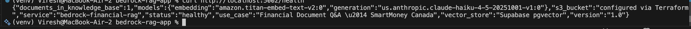
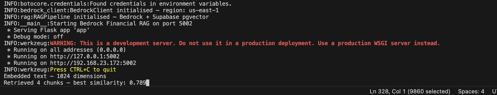
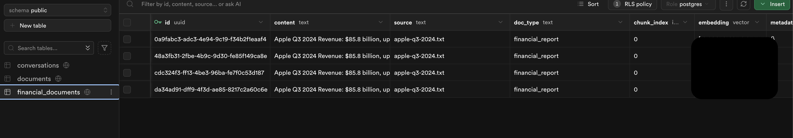
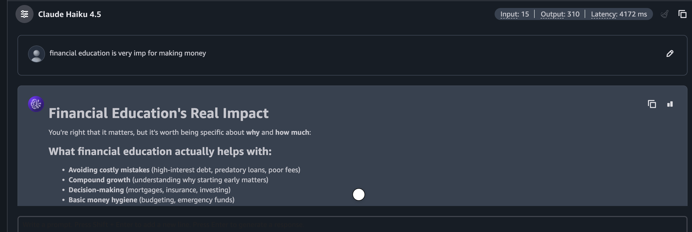
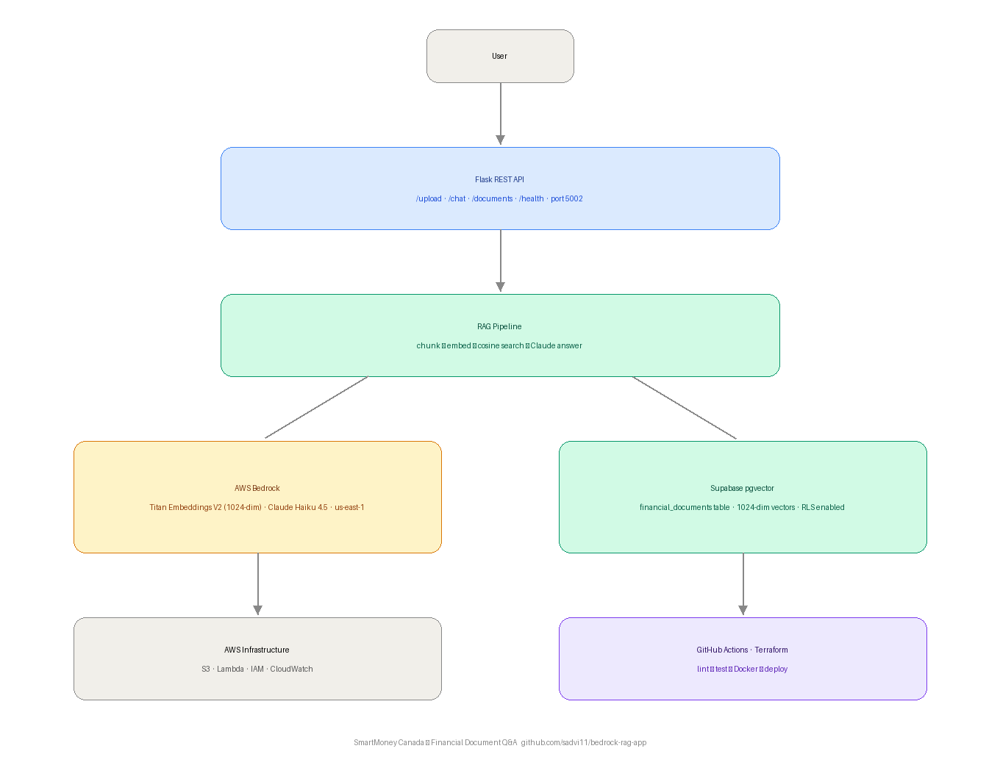

# Bedrock Financial RAG — AWS Bedrock + Claude Haiku 4.5

> Production-grade Financial Document Q&A powered by AWS Bedrock — upload financial reports, ask plain English questions, get instant answers grounded in your documents.

[](https://python.org)
[](https://aws.amazon.com/bedrock)
[](https://flask.palletsprojects.com)
[](https://supabase.com)
[](https://terraform.io)
[]()

---

## What This Project Does

A production RAG (Retrieval Augmented Generation) pipeline for financial documents — built entirely on AWS Bedrock managed services. Upload any financial report (annual report, earnings statement, budget document) and ask plain English questions. The system finds the most relevant sections and generates accurate, grounded answers using Claude Haiku 4.5.

**Business value:** Makes financial documents accessible to everyday Canadians — the SmartMoney Canada mission.

---

## Architecture

```
                        USER QUESTION
                             │
                    ┌────────▼────────┐
                    │   Flask API     │
                    │  /upload        │
                    │  /chat          │
                    │  /documents     │
                    │  /health        │
                    └────────┬────────┘
                             │
              ┌──────────────▼──────────────┐
              │         RAG Pipeline        │
              │                             │
              │  1. Embed query (Titan V2)  │
              │  2. Cosine similarity search│
              │  3. Retrieve top-4 chunks   │
              │  4. Generate with Claude    │
              └──┬──────────┬──────────┬───┘
                 │          │          │
        ┌────────▼──┐ ┌─────▼──┐ ┌────▼──────────────┐
        │  Bedrock  │ │ Bedrock│ │  Supabase         │
        │  Titan V2 │ │ Claude │ │  pgvector         │
        │ Embeddings│ │Haiku4.5│ │  1024-dim vectors │
        │ 1024-dim  │ │via AWS │ │  financial_docs   │
        └───────────┘ └────────┘ └───────────────────┘
                 │
        ┌────────▼──────────────┐
        │  AWS Infrastructure   │
        │  S3 (doc storage)     │
        │  Lambda (S3 trigger)  │
        │  CloudWatch (monitor) │
        │  IAM (least privilege)│
        └───────────────────────┘
```

---

## Nokia 5G → AWS Bedrock Architecture Mapping

| Nokia 5G Function | AWS Bedrock Equivalent | Purpose |
|---|---|---|
| AMF (Access & Mobility) | Flask API + RAG Pipeline | Decision-making — routes requests to right service |
| UDM (User Data Management) | Supabase pgvector | Persistent vector storage and retrieval |
| CBIS (OpenStack private cloud) | AWS Bedrock managed service | Managed infrastructure — no servers to manage |
| CBAM (VNF orchestration) | Lambda + S3 trigger | Event-driven document processing automation |
| Subscriber dimensioning | Titan Embeddings V2 | Translate content into 1024-dim vector space |
| OAM monitoring | CloudWatch + Lambda logs | Operational monitoring and alerting |
| Nokia Repository Function | IAM least-privilege roles | Resource governance and access control |

---

## Components

| Component | Technology | Purpose |
|---|---|---|
| Embedding Model | Amazon Titan Embeddings V2 (1024-dim) | Converts financial text to semantic vectors via AWS Bedrock |
| Generation Model | Claude Haiku 4.5 via AWS Bedrock | Answers questions grounded in retrieved context |
| Vector Store | Supabase pgvector (1024-dim) | Stores and searches document embeddings |
| Document Storage | AWS S3 | Stores uploaded financial documents |
| Processing | AWS Lambda (S3 trigger) | Serverless document ingestion pipeline |
| Infrastructure | Terraform IaC | S3 + Lambda + IAM + CloudWatch provisioned as code |
| CI/CD | GitHub Actions | Lint → test → Lambda package build → Terraform deploy |
| API Layer | Flask REST | 4 production endpoints |

---

## RAG Pipeline — How It Works

```
DOCUMENT UPLOAD                    QUESTION ANSWERING
───────────────                    ──────────────────
POST /upload                       User question
      │                                  │
  chunk_text()                    Bedrock Titan V2
  (500-word chunks)               embed question
      │                                  │
  Bedrock Titan V2                cosine similarity
  embed each chunk                search pgvector
  (1024 dimensions)                      │
      │                            top-4 chunks
  store in Supabase               retrieved (best: 0.789)
  pgvector table                         │
                                  inject into Claude
                                  system prompt
                                         │
                                  Claude Haiku 4.5
                                  generates answer
                                  grounded in YOUR data
```

---

## Key Design Decisions

**Why AWS Bedrock instead of Anthropic direct API?**
AWS Bedrock is the enterprise deployment pattern — managed scaling, AWS IAM integration, no API key management, usage tracked in AWS billing. Companies building production AI on AWS use Bedrock. Direct API is for prototypes; Bedrock is for production.

**Why Titan Embeddings V2 (1024-dim) instead of sentence-transformers?**
Titan V2 runs on AWS infrastructure — same network as your S3 and Lambda. No model download, no local compute, scales automatically. Also supports 256/512/1024 dimensions — 1024 chosen for best semantic accuracy on financial terminology.

**Why pgvector over Amazon OpenSearch Serverless?**
pgvector on Supabase = zero additional AWS cost, familiar PostgreSQL interface, RLS security already configured. OpenSearch Serverless costs ~$0.24/OCU-hour — for a portfolio project, pgvector is the right choice. Production at scale would use OpenSearch.

**Why Lambda for document ingestion?**
S3 upload → Lambda trigger = zero servers, scales to zero when idle, no cost between uploads. Exactly how Netflix encodes new content — event-driven, serverless, automatic.

---

## Quick Start

```bash
# Clone
git clone https://github.com/sadvi11/bedrock-rag-app.git
cd bedrock-rag-app

# Install dependencies
python3 -m venv venv
source venv/bin/activate
pip install -r requirements.txt

# Configure environment
cp .env.example .env
# Add: AWS credentials, Supabase URL + key

# Setup Supabase (run once)
# Paste supabase_setup.sql in Supabase SQL Editor

# Run
python app.py

# Upload a financial document
curl -X POST http://localhost:5002/upload \
  -H "Content-Type: application/json" \
  -d '{"text": "Apple Q3 2024 Revenue: $85.8 billion...", "source": "apple-q3.txt"}'

# Ask a question
curl -X POST http://localhost:5002/chat \
  -H "Content-Type: application/json" \
  -d '{"question": "What was Apple iPhone revenue?"}'

# Check health
curl http://localhost:5002/health
```

---

## API Endpoints

| Endpoint | Method | Description |
|---|---|---|
| `/upload` | POST | Upload financial document → chunk → embed → store |
| `/chat` | POST | Ask question → RAG retrieval → Claude answer |
| `/documents` | GET | List all documents in knowledge base |
| `/health` | GET | Service health + model info + document count |

---

## Security Design

- **IAM least privilege** — Lambda role has only Bedrock InvokeModel + S3 read permissions
- **S3 encryption** — AES-256 server-side encryption on all documents
- **Private S3 bucket** — all public access blocked
- **Supabase RLS** — Row Level Security enabled on financial_documents table
- **No hardcoded credentials** — all secrets via environment variables

---

## Deployment Screenshots

| Screenshot | What It Proves |
|---|---|
| `screenshots/health-endpoint.png` | Service healthy, Titan V2 + Claude Haiku 4.5 connected |
| `screenshots/chat-answer.png` | Full RAG pipeline — correct financial answer from document |
| `screenshots/terminal-logs.png` | 1024-dim embeddings + 0.789 similarity score |
| `screenshots/supabase-financial-documents.png` | Vectors stored in pgvector |
| `screenshots/bedrock-playground.png` | Claude Haiku 4.5 working in AWS Bedrock |

---

## Interview Talking Points

- **Why Bedrock over direct API** — enterprise pattern, AWS IAM integration, managed scaling
- **RAG vs fine-tuning** — RAG retrieves dynamically from updatable database; fine-tuning bakes knowledge permanently
- **Titan Embeddings V2** — 1024-dim, normalized vectors, same AWS network as compute
- **pgvector cosine similarity** — dot product of normalized vectors = cosine distance
- **Lambda trigger pattern** — same as Netflix encoding pipeline; event-driven, zero idle cost
- **Nokia bridge** — CBIS (OpenStack) → AWS Bedrock managed infra; CBAM orchestration → Lambda event triggers

---

## Repository Structure

```
bedrock-rag-app/
├── app.py                    # Flask REST API — 4 endpoints
├── bedrock_client.py         # AWS Bedrock — Titan V2 + Claude Haiku 4.5
├── rag.py                    # RAG pipeline — chunk, embed, store, retrieve
├── requirements.txt
├── supabase_setup.sql        # One-time Supabase table setup
├── .env.example
├── .gitignore
├── lambda/
│   └── ingest.py             # Lambda — S3 trigger → process → store
├── infrastructure/
│   └── main.tf               # Terraform — S3 + Lambda + IAM + CloudWatch
├── .github/workflows/
│   └── deploy.yml            # GitHub Actions CI/CD
└── screenshots/              # Deployment proof
```

---

## Author

**Sadhvi Sharma** — Cloud & AI Engineer
Nokia India (5G Packet Core) → Cloud & AI Engineering
Calgary, AB, Canada | Permanent Resident | Open to Relocation

[LinkedIn](https://linkedin.com/in/sadhvi-sharma-5789a6249) | [GitHub](https://github.com/sadvi11) | [@smart_moneycanada](https://instagram.com/smart_moneycanada)

## Live Screenshots












## Live Screenshots


## Example — TD Bank Dividend Analysis

Upload TD Bank earnings report and ask:
> *"Is TD Bank a good stock for dividend income?"*

The app retrieves relevant sections and answers:
- 165+ consecutive years of uninterrupted dividends
- $1.02 per share quarterly dividend
- 13.9% Common Equity Tier 1 ratio
- Net income $3.6 billion Q1 2024

Powered by AWS Bedrock Titan V2 + Claude Haiku 4.5 — answers grounded in the actual document, not hallucinated.
